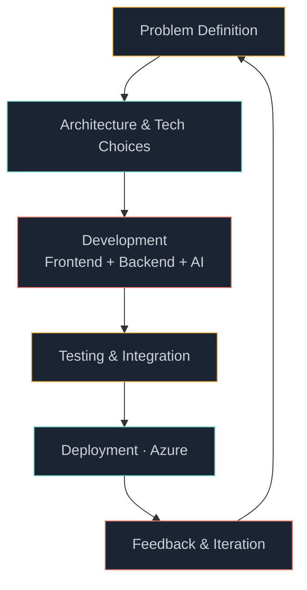

<div align="center">


<br/>


<br/><br/>


<br/><br/>

<a href="https://github.com/ganesan33"></a>
<a href="https://www.linkedin.com/in/ganesan-g-14b1852a2/"></a>
<a href="mailto:ganesanz3tg@gmail.com"></a>

</div>

<br/>

## 👋 About

I'm a **pre-final year Computer Science student at Rajalakshmi Engineering College, Chennai**, currently working as a **Software Development Engineer Intern at Firstsource**.

I build software end-to-end — from problem definition to deployment — with a focus on **full-stack development, backend engineering, AI-powered applications, and cloud infrastructure**. At Firstsource, I work on AI agents, enterprise full-stack apps, multi-agent systems, workflow automation, and Azure deployments.

```
Currently building   →  AI-powered applications & enterprise automation
Currently learning   →  Advanced backend architecture, cloud engineering
Currently exploring  →  Multi-agent AI systems, modern LLM applications
Ask me about         →  Full-stack dev, AI agents, backend systems
```

<br/>

## 📊 Snapshot

<table>
<tr>
<td width="50%" valign="top">

**Education** — B.E. Computer Science, Rajalakshmi Engineering College
**Graduating** — 2027
**Role** — SDE Intern @ Firstsource *(Dec 2025 – Present)*
**Location** — Chennai, India

</td>
<td width="50%" valign="top">

**Focus** — Full-Stack Development & AI Applications
**Cloud** — Microsoft Azure
**Hackathon** — SIH Finalist 2026
**Prior** — SIH Top 100, 2025

</td>
</tr>
</table>

<br/>

## 🧬 GitHub Stats

<div align="center">


<br/>


<br/>


</div>

> Stat cards render live from GitHub's public API — numbers update automatically as the repos grow.

<br/>

## 🛠️ Tech Stack

<table>
<tr><td><b>Languages</b></td><td></td></tr>
<tr><td><b>Frontend</b></td><td></td></tr>
<tr><td><b>Backend</b></td><td></td></tr>
<tr><td><b>Databases</b></td><td></td></tr>
<tr><td><b>Cloud & DevOps</b></td><td></td></tr>
</table>

**Proficiency**

```
Full-Stack Development   ████████████████░░░░  80%
Backend & APIs           ██████████████████░░  90%
AI / Agent Systems       ███████████████░░░░░  75%
Cloud (Azure)            █████████████░░░░░░░  65%
DevOps / CI-CD           ████████████░░░░░░░░  60%
```

<br/>

## 🤖 AI / ML Focus

I build AI that's woven into real software systems — not bolted on as a demo.

| Area | Experience |
|---|---|
| 🤖 AI Applications | Agentic apps built on Lyzr AI, deployed in production workflows |
| 🔗 Multi-Agent Systems | Agent-to-Agent (A2A) communication between Lyzr agents & GitHub Copilot |
| 🧠 NLP | Transformer-based lyric & text processing |
| 🎵 Recommendation Systems | Emotion-aware music recommendation engine |
| 😊 Emotion Classification | Multi-class emotion detection models |
| 🔄 Reinforcement Learning | Recommendation tuning from live user interaction |
| 🌍 Multilingual AI | Cross-language lyric emotion detection |

<br/>

## 🚀 Featured Projects

<table>
<tr>
<td width="50%" valign="top">

### 🎵 Emotion-Aware Music Recommender
AI system that reads song lyrics, detects emotional patterns, and recommends music by mood.
- Custom emotion classification model
- Mood-based recommendation engine
- RL-driven recommendation improvement
- Multilingual lyric processing

`Node.js` `Express` `Python` `Transformers` `Scikit-learn`

</td>
<td width="50%" valign="top">

### 📚 eduFlow — E-Learning Platform
Full-stack platform focused on secure auth, course management, and automated delivery.
- Secure authentication + email verification
- Course management workflows
- CI/CD pipeline via Azure DevOps

`React` `Node.js` `Express` `MongoDB` `Azure DevOps`

</td>
</tr>
<tr>
<td width="50%" valign="top">

### 🚌 NFC Bus Tracking System
Real-time student transportation system pairing web tech with ESP32 + NFC hardware.
- NFC-based student check-in
- Live bus & route tracking
- Seat availability monitoring
- Real-time push notifications

`React` `Flask` `Firebase` `ESP32` `NFC`

</td>
<td width="50%" valign="top">

### ♿ ClearComm — Accessible Comms
Real-time communication platform built around assistive technology.
- WebRTC video + WebSocket messaging
- Speech-to-text / text-to-speech
- Accessibility-first UX

`React` `Node.js` `WebRTC` `WebSockets`

</td>
</tr>
</table>

<br/>

## 💼 Experience

**Software Development Engineer Intern** — Firstsource
*December 2025 – Present*

- 🤖 Built AI agents for interview automation, personal assistance, daily news, and tutoring using **Lyzr AI**
- 🌐 Developed a full-stack exit interview system with **Next.js, Django & PostgreSQL**, including multi-agent integration
- 🔗 Implemented **Agent-to-Agent (A2A)** communication between Lyzr agents and GitHub Copilot in **Node.js**
- ⚙️ Improved SharePoint workflows and enterprise process automation
- ☁️ Deployed and maintained applications on **Microsoft Azure**

`Next.js` `Django` `Node.js` `PostgreSQL` `Lyzr AI` `Azure` `GitHub Copilot`

<br/>

## 🏆 Hackathons

| Event | Result |
|---|---|
| Smart India Hackathon 2026 | 🥇 **Finalist** |
| Smart India Hackathon 2025 | 🏅 **Top 100 teams** |

<br/>

## 🧭 How I Build



> **Build useful software, understand the systems behind it, keep improving.**

<br/>

## 🌱 Beyond Code

Learning how systems work internally · Designing practical applications · Experimenting with AI · Turning ideas into working products · Collaborating on teams · Competing in hackathons

<br/>

## 🤝 Let's Connect

Interested in `Software Engineering` · `Full-Stack Dev` · `AI Applications` · `Backend Systems` · `Cloud` · `Hackathons` · `Open Source`

<div align="center">

<a href="https://github.com/ganesan33"></a>
<a href="https://www.linkedin.com/in/ganesan-g-14b1852a2/"></a>
<a href="mailto:ganesanz3tg@gmail.com"></a>

<br/><br/>

### Build → Learn → Improve → Repeat


</div>
